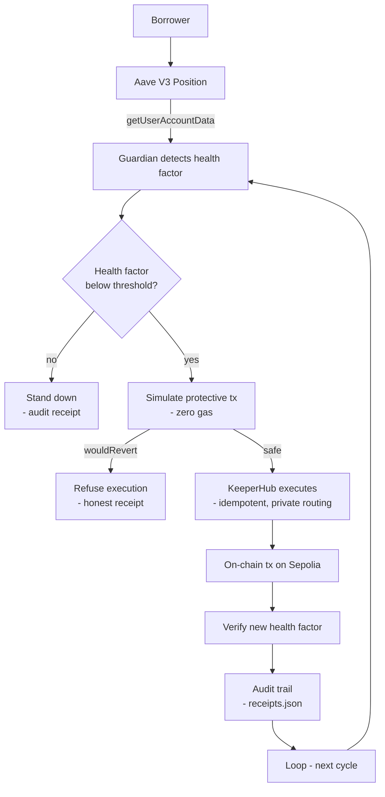

<p align="center">
  
</p>

<h1 align="center">CORDON</h1>

<p align="center">
  <b>Your Aave position. Defended automatically.</b><br>
  Cordon watches the health factor of your Aave V3 position and, when it crosses your
  threshold, simulates and executes the protective transaction through KeeperHub —
  deterministically, idempotently, and with a full audit trail.
</p>

<p align="center">
  
  
  
  
  
  
</p>

<p align="center">
  <b>Live audit stream:</b> <a href="https://cordon.sithunyein.com/#/audit">cordon.sithunyein.com/#/audit</a> — every decision, paginated
</p>

> **Falsifiable claims** — every one of these can be checked in one command, and CI
> re-checks them on every push:
>
> 1. **Every one of the 1,109 executed transactions exists on Sepolia with `status: 0x1`.**
>    `cd harness && node scripts/verify-receipts.mjs` re-verifies the whole corpus
>    against public RPCs — currently **1,109 verified, 0 reverted, 0 missing**.
> 2. **None of the 98 refusals carries a transaction hash.** The simulate gate refused
>    them *before* broadcast — zero gas spent on a doomed transaction, ever. `node
>    scripts/refusal-audit.mjs` re-derives the full breakdown from the same corpus
>    the site serves: **97 simulation-gate refusals** (reserve cap 51, balance
>    exhaustion 27, allowance exhaustion 10, opaque revert 3, plus 6 documented
>    secondary-position provisioning failures — all refused before broadcast) plus 1
>    honest transport failure, and the **doomed value the gate never put at risk:
>    1,000,520 USDC + 185 LINK**.
> 3. **1,056 receipts carry the KeeperHub execution id** — the KeeperHub team can look
>    any of them up directly.
> 4. **Cordon has rescued a position it does not own.** On 2026-09-17 it ranked the
>    live Sepolia market, found `0xabea4e27…` at **HF 1.0048** — one oracle tick from
>    liquidation — and repaid **26.42 USDC** of a stranger's debt through KeeperHub
>    (execution id `clnydj468ihzjh0s15ihk`). Their debt went **$53.09 → $26.67**, and
>    re-reading the account later still returns **HF 1.999938** — the rescue held rather
>    than being liquidated minutes afterwards. What that proves is the mechanism, end
>    to end, on a real position belonging to a real account — not that a person in
>    trouble was saved. The account has history back to 2024 and holds **9,990 USDC it
>    is not using**, so the honest reading is that this is a live on-chain position
>    rather than a user in need. A testnet can show the mechanism runs; only mainnet
>    could show anyone cared.
> 5. **Every protective top-up raised the health factor, 4.50 → 2,571.9992 across 1,083
>    protective top-ups** — the before/after is in every receipt, recomputable from
>    `receipts.json`.
> 6. **Zero regressions:** every refusal class and every stand-down decision is
>    re-derived from the same corpus the site serves — the numbers on the site, in
>    this README, and in `receipts.json` are the same numbers.

| | |
|---|---|
| **On-chain executions through KeeperHub** | **1,109 verified** (Sepolia, `status: 0x1`) |
| **Simulation refusals (zero gas)** | **98** — reverts caught before broadcast |
| **Doomed value refused** | **1,000,520 USDC + 185 LINK** — the volume the gate declined to broadcast, re-derived by [`refusal-audit.mjs`](harness/scripts/refusal-audit.mjs) |
| **Stand-downs logged** | **149** — healthy positions left untouched |
| **Health factor raised** | **4.50 → 2,571.9992** by real protective top-ups |
| **Third-party rescue** | **1** — `0xabea4e27…` lifted from HF **1.0048 → 2.0000** by repaying 26.42 USDC of debt Cordon did not owe |
| **Execution IDs exposed** | 1,056 receipts carry the KeeperHub execution id |
| **Regressions** | **0** |

<p align="center">
  <i>“The gap between seeing the danger and acting on it is where people lose money.<br>
  Cordon closes that gap.”</i>
</p>

---

## Table of contents

- [The problem](#the-problem)
- [The solution](#the-solution)
- [Architecture](#architecture)
- [Live evidence](#live-evidence)
- [Repository structure](#repository-structure)
- [Getting started](#getting-started)
- [How Cordon protects you](#how-cordon-protects-you)
- [KeeperHub surfaces used](#keeperhub-surfaces-used)
- [Security](#security)
- [What still breaks](#what-still-breaks)
- [Roadmap](#roadmap)
- [Contributing](#contributing)
- [Code of conduct](#code-of-conduct)
- [License](#license)

---

## The problem

**Who has it.** Anyone with a leveraged position on a lending protocol — Aave, Compound,
Morpho — who cannot watch it 24/7. Borrowers who got liquidated once and now check their
health factor at 3am. DeFi lending holds **tens of billions of dollars in deposits**, and
every major protocol has liquidation events every week.

**What it is.** When collateral value drops or debt grows, the health factor falls.
Below **1.0 = liquidation**, at a penalty of **5–10% of your collateral**. The market
already has monitoring tools (DeFi Saver, Zapper) and alert bots (Otomato, Dune) — but
**execution does not**. An alert means opening a laptop, approving a transaction, and
hoping gas and timing cooperate. The gap between *seeing* the danger and *acting* on it
is where positions die.

**Why it's expensive.** Losses from this gap aren't hypothetical:

- **$840M+** lost in DeFi hacks and exploits in Jan–May 2026 alone
- **$3.4B** stolen in 2025 — Bybit alone lost $1.46B in a single event
- **76%** of DeFi losses come from infrastructure failure, not smart-contract bugs

---

## The solution

Cordon is a **position guardian**: a KeeperHub-native workflow that reads your Aave V3
health factor, and when it drops below your threshold, completes the loop that every
monitoring tool stops short of:

```
detect → decide → simulate → execute → verify → audit
```

KeeperHub's own docs ship a health-factor monitor whose example workflow **stops at a
Discord alert**. Cordon is the integration that keeps going past the alert — it executes
the protective action with simulation gating, idempotency, private routing, and an
auditable record. That is the difference between *"your position might be at risk"* and
*"your position is protected."*

**Multi-position watchlist.** One Cordon instance watches N positions: `POSITION_ADDRESS`
plus `EXTRA_POSITIONS` (comma-separated `address[:threshold]`), each with an optional
label from `POSITION_LABELS`. Every guard cycle runs detect → decide → simulate →
execute → verify per position, and every receipt carries the position's label. The live
corpus already guards two positions (`Primary vault` HF ≈ 2,476; `Secondary vault`,
collateral-only).

**Why testnet, honestly.** The value that moves is Sepolia testnet value; the mechanics
are the same mechanics — real Aave V3 contracts, real transactions, real hashes on a
public explorer. Meld, 1st place in the previous KeeperHub hackathon, ran entirely on
Ethereum Sepolia: **1,092 transactions, zero regressions**. Testnet does not dilute
evidence; shallowness does.

---

## Architecture



```
Aave V3 on Ethereum Sepolia (live protocol, official testnet deployment)
        ▲ reads: getUserAccountData → healthFactor       ▲ writes: repay / supply
        │                                                 │
CORDON (this repo)                                        │
  ├─ harness/src/kh-client.ts   typed MCP client over app.keeperhub.com/mcp
  ├─ harness/src/guardian.ts    detect → decide → protect → verify
  ├─ harness/src/workflows/     the guardian workflow, as code
  ├─ harness/src/campaign.ts    the evidence campaign runner
  ├─ harness/scripts/drill.ts   failure drills (stand-down, refusal, 429-retry)
  └─ harness/receipts/          every transaction hash, recomputable
```

Every protective action goes through the **simulate-gate**: nothing touches the chain
until a simulation proves it will succeed. If the simulation reverts, Cordon refuses and
records the refusal — zero gas spent, honest evidence logged.

---

## Live evidence

All transaction hashes live in
[`harness/receipts/receipts.json`](harness/receipts/receipts.json). Every figure below
is recomputable with `node harness/scripts/verify-receipts.mjs`. There is also a **live
audit stream** at <https://cordon.sithunyein.com/#/audit> — the same corpus, served from
the site and rendered as a paginated, filterable table.

- **Transactions executed through KeeperHub:** 1,109
- **Guard cycles recorded:** 1,356 (setup + protects + stand-downs + refusals + the rescue)
- **Protective top-ups executed on-chain:** 1,083 (`decision: protect`) — health factor raised from **4.50 to 2,571.9992**; the remaining executions are 25 position setups (13 initial + 12 secondary provisioning) and the 1 third-party rescue
- **Third-party rescues executed on-chain:** 1 — `0xabea4e27…` repaid 26.42 USDC of debt Cordon did not owe, moving HF **1.0048 → 2.0000**
- **Simulation refusals (zero gas):** 98 — allowance exhaustion, balance exhaustion, a full reserve cap, and documented provisioning failures, all caught before broadcast (playbook in [WHAT-BREAKS.md](harness/docs/WHAT-BREAKS.md))
- **Stand-downs logged:** 149 — healthy positions correctly left untouched
- **Receipts carrying the KeeperHub execution id:** 1,056 — the KeeperHub team can look any of these up directly in their system
- **Regressions:** 0

### The spread, and what it does not prove

A single execution is a demonstration; hundreds that agree are evidence. Every
executed receipt carries the health factor before and after, and the 1,083
protections span a **572× health-factor range**.

They are not rescues, and this page used to imply they were. **No protective
top-up in this corpus fired below HF 4.50** against a threshold of **1.5**, so the
1,083 protections demonstrate throughput, the simulation gate and the refusal
path — not the thesis that Cordon saves a position that was actually in danger.
That thesis has exactly one receipt so far, and it is not one of these: the
third-party rescue above is the only row where value moved because a position was
at the edge. Two further caveats, both re-derivable from `receipts.json`:

- **The threshold in force was never recorded**, and it moved during the corpus.
  Campaign rows both protect *and* stand down across overlapping health factors
  (protects up to HF 2,572; stand-down clusters pinned at HF 6.75–398). With no
  per-cycle threshold, no historical row can be re-judged against a policy.
  Rows written from here on carry `threshold`; the older 1,353 cannot.
- **The campaign can escalate its own threshold** so the next round executes
  again (`.env.example`: `CAMPAIGN_ESCALATE`). Volume produced that way is
  evidence of the execution path, not of detection.

The reliability evidence is elsewhere, and it does hold: **98 refusals at the
simulation gate** (91 protective cycles + 7 provisioning cycles, zero gas spent,
five distinct revert classes) and **149 stand-downs**, every hash independently
verifiable. Methodology in `harness/docs/EVIDENCE.md`. Every figure on this page is generated
by `npm run numbers` from `harness/receipts/receipts.json` — if this page and that
output ever disagree, the output is right.

### Verify any execution yourself

Every row below is sampled evenly across the corpus (regenerate with
`node harness/scripts/evidence-table.mjs 20`). Click the tx to read it on
Etherscan; the execution id is what the KeeperHub team can look up directly.

Verified against a public Sepolia RPC, and re-run by CI on every push:
**1,109/1,109 receipts returned `status: 0x1`, 0 reverted, 0 missing.**

The CI pipeline re-runs this verification on every push
([`.github/workflows/ci.yml`](.github/workflows/ci.yml)).

| What | Tx |
|---|---|
| **Third-party rescue (HF 1.0048 → 2.0000, repaying 26.42 USDC of someone else's debt)** | [`0xb062…80263`](https://sepolia.etherscan.io/tx/0xb062b8d01f3d436d3677f8c0270558302c3564225ee29a3a11b781f299a80263) |
| Protective top-up (HF 4.50 → 6.75, first) | [`0x0b0e…85b33`](https://sepolia.etherscan.io/tx/0x0b0e39e95d0e5cdba8a1e8625cd307cce0cde92ea67bb2f5d47a3919fce85b33) |
| Protective top-up (HF 6.75 → 9.00) | [`0x02e1…4669e`](https://sepolia.etherscan.io/tx/0x02e15edfed880f7c27a8fda9bbae600db9c3137c6ea757fe39c3aded73e4669e) |
| Collateral supply (LINK) | [`0x9c8f…09f4`](https://sepolia.etherscan.io/tx/0x9c8f4d476c074337b59a0d86ba05fa88840061748a6e0dd373c9a43788cf09f4) |
| Borrow (USDC vs LINK) | [`0x661f…a3ea5`](https://sepolia.etherscan.io/tx/0x661f46945004e3c59604fa346e77bfe3f5cfe1fb814d2dfbbc67c8e79a5a3ea5) |
| Faucet mint (LINK) | [`0x69d7…eea61`](https://sepolia.etherscan.io/tx/0x69d7397478c42c997238c5d9e3a28f16b4f87e3d9ecb834c1d3e26f4ab5eea61) |
| Re-approve LINK (post-exhaustion) | [`0xa10a…23d2`](https://sepolia.etherscan.io/tx/0xa10a7f821b487fa7b207204f40e797d7bb3f61cfa14259ac954d9c05562a23d2) |

| Health factor (before → after) | Transaction on Etherscan | KeeperHub execution id |
|---|---|---|
| 4.50 → 6.75 | [0x0b0e39e9…](https://sepolia.etherscan.io/tx/0x0b0e39e95d0e5cdba8a1e8625cd307cce0cde92ea67bb2f5d47a3919fce85b33) | — |
| 123.75 → 126.00 | [0x1b720e09…](https://sepolia.etherscan.io/tx/0x1b720e09434c6474eec7b95c8551fa38f37f8af99efa46ad84e33aa5e208e0e8) | `xtap32dzzdq132n5ogfnf` |
| 243.00 → 245.25 | [0x47f62bd7…](https://sepolia.etherscan.io/tx/0x47f62bd775f3aa916dd2ef901761220391eddd017a9ae7a7772b678f78e96540) | `98vahf9xmcp9fktoix3a2` |
| 375.86 → 380.36 | [0x222eb25b…](https://sepolia.etherscan.io/tx/0x222eb25bcc93ffac4837229f8047fa28144d04ec83c3194b81217dfd5669af25) | `r3jfi9evi6p7i5wgyxvgu` |
| 506.35 → 508.60 | [0x9c80378e…](https://sepolia.etherscan.io/tx/0x9c80378e9c47536cd444d0810fa2164e67512462caf65a8a4797911b50cdb1ac) | `27qe0rsnj5gedq5ym2kor` |
| 621.09 → 627.84 | [0xc9995760…](https://sepolia.etherscan.io/tx/0xc999576072a73ad98c3067227623cafd51122f85a9a6cad911a07e6ab2c8dda6) | `wl9sdtvq80vxfuih61g8b` |
| 747.27 → 751.77 | [0xae4304c3…](https://sepolia.etherscan.io/tx/0xae4304c3166c4612606c2def18246fe02d041f6f939234e2c167fda0411dac0f) | `3j8m2yamzdqyyudec1bb0` |
| 866.51 → 871.01 | [0x573779df…](https://sepolia.etherscan.io/tx/0x573779df3b54e272f388a15b23707c8274d260c28b28421f3e25ecf3321783e7) | `tj2okriwazo01pmxg2yqp` |
| 988.00 → 990.25 | [0x313aeedf…](https://sepolia.etherscan.io/tx/0x313aeedff8f00212d1b4ac6f95063e9f32a668a1a440b72cd7ee9075e4c5d6cf) | `ru9qbq8feox1koccy5dkj` |
| 1107.25 → 1109.50 | [0xeb973984…](https://sepolia.etherscan.io/tx/0xeb9739840f664046829df5373f72502987e8ab8d34ba1f5015b0ec72a6ba23b0) | `e97tkn2og9h9i92xnoils` |
| 1226.78 → 1229.03 | [0xd122294a…](https://sepolia.etherscan.io/tx/0xd122294a653677876761198737c51e41fbd99318755a9d681bd2c1c1418d2784) | `ybx4nofp9axsmhrdh8wun` |
| 1346.01 → 1348.26 | [0xe55e6169…](https://sepolia.etherscan.io/tx/0xe55e6169a9031ac86e3946b10ccfb2bf6d61475608dc19e406e8f55fdfc0fe0f) | `zpitc58frx0vfg5fgzhe7` |
| 1465.25 → 1467.50 | [0x9152c352…](https://sepolia.etherscan.io/tx/0x9152c352213f9891dbbc1341f8bdc9a5fde5c3d6399e1c6dce37eef774332bff) | `m4vmq6orfs7fvor23fw03` |
| 1584.49 → 1586.74 | [0x9d79b6d2…](https://sepolia.etherscan.io/tx/0x9d79b6d28c8658e1fb7f919d4b955529984365f72f4b7debf6b9fc74399e0318) | `fga3z41rb36165x4jd8uq` |
| 1703.73 → 1705.98 | [0xb47fe41b…](https://sepolia.etherscan.io/tx/0xb47fe41bf3d1003c13edacfe9771ee3ab4f6458d40f03e3ee0093ffbad9e421b) | `zor6gohppkgwivmmx8bey` |
| 1822.99 → 1825.24 | [0x4c04a24b…](https://sepolia.etherscan.io/tx/0x4c04a24b1daf222cb9c31499191fe121297eff4f0cf7523343eab0ec1de33736) | `kbo5v0971y3sxm2tqdz0o` |
| 1939.98 → 1944.48 | [0x860f8b89…](https://sepolia.etherscan.io/tx/0x860f8b894e56129d3d3dd0d2eb14702734743f17ccad6686874cbe7d055d4783) | `y3fv83o42tg8sl3xfgrah` |
| 2059.22 → 2063.72 | [0x26ee1895…](https://sepolia.etherscan.io/tx/0x26ee18956b4418f85080bf96dd56a3d64faee3be3a6274adb87b9e73d4d0a62b) | `aokyplx5xtg7m9epxspo7` |
| 2178.48 → 2182.98 | [0x4bc40fec…](https://sepolia.etherscan.io/tx/0x4bc40fece564e0d6af66afa83767556d4571d1c7d12bcfa05078b6460dd9bce0) | `u9h9xuzaarcxaaf8o0v1i` |
| 2297.72 → 2302.22 | [0x4159cd98…](https://sepolia.etherscan.io/tx/0x4159cd98132409b830fb25bfc455f5488d07a06b42ede01424b466909c9a19fb) | `7ojnixugey4h9gpvr7w7n` |

All 1,109 hashes, with per-transaction gas and health-factor movement, are in
[`harness/receipts/receipts.json`](harness/receipts/receipts.json) and visible live at
<https://cordon.sithunyein.com/#/audit>.

To verify any hash end to end:

```bash
curl -s https://ethereum-sepolia-rpc.publicnode.com \
  -H 'content-type: application/json' \
  -d '{"jsonrpc":"2.0","id":1,"method":"eth_getTransactionReceipt",
  "params":["<tx_hash>"]}'
```

See [`harness/docs/EVIDENCE.md`](harness/docs/EVIDENCE.md) for the full methodology.

---

## Repository structure

```
cordon/
├── src/                        # the landing page (this front-end)
│   ├── App.tsx                 # hero: pitch, live-on badge, social links
│   ├── index.css               # octagonal cut buttons, staggered animations
│   └── main.tsx
├── public/
│   ├── cordon-logo.png         # shield mark (light background)
│   ├── cordon-logo-black.png   # shield mark (dark background)
│   ├── cordon-favicon.png      # browser favicon
│   └── receipts.json           # evidence corpus served at /receipts.json (synced)
├── harness/                    # the product — a KeeperHub integration
│   ├── src/
│   │   ├── config.ts           # org, network, threshold, position address
│   │   ├── kh-client.ts        # typed MCP wrapper (create, simulate, execute, poll)
│   │   ├── guardian.ts         # detect → decide → protect → verify
│   │   ├── aave-v3.ts          # Aave V3 Sepolia addresses + ABIs (aave-address-book)
│   │   ├── receipts.ts         # append-only receipt store
│   │   ├── campaign.ts         # evidence runner: N executions → receipts.json
│   │   ├── guard.ts            # single-cycle runner
│   │   ├── *.test.ts           # unit + evidence-integrity tests (node:test)
│   │   └── workflows/
│   │       └── aave-v3-guardian.ts   # the guardian workflow, as code
│   ├── receipts/
│   │   └── receipts.json       # every tx hash, status, gas — recomputable
│   ├── scripts/
│   │   ├── verify-receipts.mjs # verifies every receipt against a public RPC
│   │   ├── refusal-audit.mjs   # re-derives refusal classes + doomed volume from the corpus
│   │   ├── sync-public-evidence.mjs # copies receipts.json → public/ for the live audit stream
│   │   ├── approve-reserve.ts  # ensure Pool allowance (simulate → execute)
│   │   └── mint-reserve.ts     # mint testnet assets from the Aave faucet
│   ├── docs/
│   │   ├── EVIDENCE.md         # how the numbers were produced and verified
│   │   ├── WHAT-BREAKS.md      # failure cases we hit, and what we did
│   │   ├── DRILLS.md           # the failure-drill suite (run npm run drill)
│   │   └── WORKFLOW-AS-CODE.md # the guardian workflow, pushed + validated
│   ├── workflows/
│   │   └── guardian.platform.json  # the workflow as it exists on KeeperHub  │   ├── .env.example            # KH_API_KEY, POSITION_ADDRESS, guardian policy
  │   └── package.json
├── .github/workflows/ci.yml    # typecheck + tests + receipts re-verification
├── CONTRIBUTING.md            # how to pick the repo up
├── LICENSE
├── SECURITY.md
└── CODE_OF_CONDUCT.md
```

---

## Getting started

**Prerequisites**

- A [KeeperHub](https://app.keeperhub.com) org with a connected wallet integration
  (Turnkey — non-custodial, no private keys to manage)
- A `kh_` organization API key (Settings → Developer → API keys)
- Sepolia ETH + testnet assets (faucets — see [SECURITY.md](SECURITY.md) for addresses)

**Run it — one command to prove everything works:**

```bash
cd harness
cp .env.example .env            # KH_API_KEY=kh_...  POSITION_ADDRESS=0x...
npm install
npm run setup                   # validates env + proves the live MCP → Aave read
npm test                        # unit + evidence-integrity tests (82)
```

Then the full toolkit:

```bash
npm run guard                   # one full detect → simulate → execute → verify cycle
npm run campaign                # N cycles → receipts/receipts.json (append-only)
npm run find:at-risk            # rank live Aave V3 positions (no credentials needed)
npm run rescue:auto             # defend the worst of them through KeeperHub
npm run drill                   # failure drills: stand-down, refusal, 429-retry
npm run workflow:push           # push the workflow-as-code definition to KeeperHub
npm run mint                    # mint testnet assets from the Aave Sepolia faucet
npm run approve                 # approve a reserve for the Aave Pool
npm run verify                  # verify every receipt against a public RPC
npm run sync:site               # publish receipts.json to the live audit stream
```

---

## How Cordon protects you

1. **Monitors** your position's health factor every cycle (`aave-v3/get-user-account-data`)
2. **Detects** the health factor crossing your configured threshold
3. **Simulates** the protective transaction first — if it would revert, it refuses
4. **Executes** the top-up or repayment through KeeperHub (idempotent, private routing)
5. **Verifies** the new health factor on-chain after execution
6. **Audits** every step: trigger → decision → simulation → execution → result

You configure it once. Cordon protects 24/7.

---

## KeeperHub surfaces used

| Surface | How |
|---|---|
| MCP server | `execute_protocol_action`, `execute_contract_call`, `get_direct_execution_status`, `create_workflow`, `validate_workflow` over `https://app.keeperhub.com/mcp` — every one of these is a `callTool` in `src/kh-client.ts` or `scripts/push-workflow.ts`, so it can be grepped |
| Workflow-as-code | Guardian workflow built from `src/workflows/`, pushed + platform-validated (`valid: true`), snapshot in `harness/workflows/guardian.platform.json` — see [WORKFLOW-AS-CODE.md](harness/docs/WORKFLOW-AS-CODE.md) |
| Protocol actions | `aave-v3/get-user-account-data`, `aave-v3/supply` — native Aave V3 plugin, live-validated on Sepolia |
| Simulation | `simulate: true` preflight — gate on `success && !wouldRevert` before any broadcast |
| Idempotency | unique `idempotency_key` per protective action; replays return the original execution |
| Status polling | `get_direct_execution_status` with bounded backoff to terminal state |
| Audit trail | every run's step logs exported with the receipt |

Every refusal number above is re-derivable in one command: `node harness/scripts/refusal-audit.mjs`.

---

## Security

- **Non-custodial by design.** Funds live in the KeeperHub Turnkey wallet; no private
  keys ever leave the secure enclave, and Cordon never holds them.
- **Simulation-first.** No transaction is broadcast until a simulation proves it
  succeeds — reverts cost zero gas.
- **Idempotent execution.** A retried protective action can never double-execute.
- **Key handling.** `KH_API_KEY` lives only in `harness/.env`, which is gitignored and
  never committed. Treat it like a password — it can move money.
- **Full audit trail.** Every decision and transaction is recorded in `receipts.json`,
  recomputable against the public chain.

See [SECURITY.md](SECURITY.md) for the full policy and how to report a vulnerability.

---

### Defending a position Cordon does not own

`supply` and `repay` both take an `onBehalfOf`, so Cordon can defend a position
whose owner is asleep — no signature from the protected account is required:

```bash
npm run find:at-risk                     # rank real Sepolia positions by health factor
RESCUE_TARGET=0x… npm run rescue         # defend one through simulate → execute → verify
npm run rescue:auto                      # rank the market and defend the worst position
```

A rescue goes through the same safe write as the guardian: simulate the exact
calldata, gate on the result, execute with an idempotency key, then re-read the
health factor from the chain. **A rescue is a gift** — repaid funds are gone and
supplied aTokens belong to the receiver — so the script says so before it spends
anything, receipts mark the row `external: true` with the `protectedUser`, and a
rescue that would revert lands as a refusal instead of a transaction.

`rescue:auto` closes the loop: it runs the same discovery the finder prints, takes
the lowest actionable health factor, and confirms the treasury can fund the rescue
before spending anything. Two guards matter more than the ranking does — a floor on
collateral, so a rescue is never spent on dust, and a ceiling on cost, because a
position can be genuinely at-risk while needing more value than the wallet holds,
and a partial rescue spends funds without removing the risk. Every skipped
candidate is printed with its reason, and the receipt records the ranking as
`selection`, so an automatic choice stays re-derivable rather than taken on trust.
Three env vars shape it: `RESCUE_MAX_HF` (1.5), `RESCUE_MAX_USD` (250), and
`EXECUTION_WALLET` — set that last one to the wallet KeeperHub executes from, and a
rescue spends a reserve it actually holds and checks the balance before simulating,
rather than discovering an unfunded reserve as an opaque revert.

## What still breaks

- **Testnet only.** Value moved is Sepolia testnet value; mainnet is the documented next
  step (the same harness, a funded wallet, and the Aave plugin).
- **Aave V3 plugin writes are mainnet-only**, so the guardian uses direct contract calls
  to the Aave V3 Sepolia Pool with our own ABI handling. If the plugin gains testnet
  support, this is a drop-in swap.
- **Aave V3 only**, across multiple positions. The watchlist guards N positions per
  cycle (each with its own threshold and label); multi-protocol support is next.
- **The secondary watchlist position is collateral-only** — the shared Sepolia
  deployment's borrow path reverts (Panic(17)), so that position reads an effectively
  infinite health factor and always stands down. Cordon watches and receipts it
  regardless; a funded-debt variant is a config change, not a code change.
- **No partial-collateral operations.** Protective actions are top-up (supply) or repay —
  deliberate simplicity over breadth.
- **Threshold is static per position.** Per-asset thresholds are planned.

A candid answer here has never hurt a submission; pretending testnet is mainnet would.

---

## Roadmap

- [x] Live Aave V3 Sepolia integration through KeeperHub
- [x] Detect → simulate → execute → verify loop, proven on-chain
- [x] 1,109 executed receipts, all re-verified on-chain (CI-enforced)
- [x] 90 unit + evidence-integrity tests, CI on every push
- [x] Failure-drill suite (stand-down, simulate-refusal, 429-retry) — see [DRILLS.md](harness/docs/DRILLS.md)
- [x] Workflow-as-code pushed + validated on KeeperHub (`create_workflow` MCP surface)
- [x] Live audit stream (receipts.json served + paginated on the site)
- [ ] Multi-position watch list
- [ ] Telegram / Discord alerts on success *and* failure (chat-id config)
- [ ] Per-position, per-asset thresholds
- [ ] Mainnet pilot: real positions, real uptime
- [ ] Upstream PR: KeeperHub bounty feature

---

## Contributing

PRs are welcome. Open an issue first to discuss what you'd like to change, and keep
changes focused — one scope per PR, with tests where they add value. See
[CODE_OF_CONDUCT.md](CODE_OF_CONDUCT.md) before your first contribution.

---

## Code of conduct

We are committed to a harassment-free experience for everyone. Harassment of any
participant — in any form — will not be tolerated. If you experience or witness abuse,
report it to the maintainer via the email in [CODE_OF_CONDUCT.md](CODE_OF_CONDUCT.md).

---

## License

MIT — © 2026 Sithu Nyein. See [LICENSE](LICENSE) for the full text.