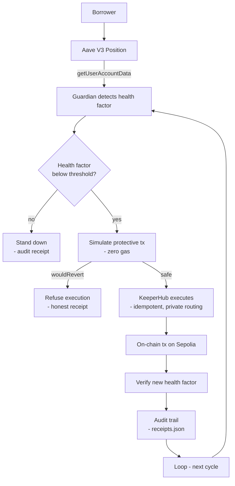

<p align="center">
  
</p>

<h1 align="center">CORDON</h1>

<p align="center">
  <b>Your Aave position. Defended automatically.</b><br>
  Cordon watches the health factor of your Aave V3 position and, when it crosses your
  threshold, simulates and executes the protective transaction through KeeperHub —
  deterministically, idempotently, and with a full audit trail.
</p>

<p align="center">
  
  
  
  
  
  
</p>

<p align="center">
  <b>Live audit stream:</b> <a href="https://cordon.sithunyein.com/#/audit">cordon.sithunyein.com/#/audit</a> — every decision, paginated
</p>

| | |
|---|---|
| **On-chain executions through KeeperHub** | **318 verified** (Sepolia, `status: 0x1`) |
| **Simulation refusals (zero gas)** | **65** — reverts caught before broadcast |
| **Stand-downs logged** | **134** — healthy positions left untouched |
| **Health factor raised** | **4.50 → 67.50** by real protective top-ups |
| **Execution IDs exposed** | 125 receipts carry the KeeperHub execution id |
| **Regressions** | **0** |

<p align="center">
  <i>“The gap between seeing the danger and acting on it is where people lose money.<br>
  Cordon closes that gap.”</i>
</p>

---

## Table of contents

- [The problem](#the-problem)
- [The solution](#the-solution)
- [Architecture](#architecture)
- [Live evidence](#live-evidence)
- [Repository structure](#repository-structure)
- [Getting started](#getting-started)
- [How Cordon protects you](#how-cordon-protects-you)
- [KeeperHub surfaces used](#keeperhub-surfaces-used)
- [Security](#security)
- [What still breaks](#what-still-breaks)
- [Roadmap](#roadmap)
- [Contributing](#contributing)
- [Code of conduct](#code-of-conduct)
- [License](#license)

---

## The problem

**Who has it.** Anyone with a leveraged position on a lending protocol — Aave, Compound,
Morpho — who cannot watch it 24/7. Borrowers who got liquidated once and now check their
health factor at 3am. DeFi lending holds **tens of billions of dollars in deposits**, and
every major protocol has liquidation events every week.

**What it is.** When collateral value drops or debt grows, the health factor falls.
Below **1.0 = liquidation**, at a penalty of **5–10% of your collateral**. The market
already has monitoring tools (DeFi Saver, Zapper) and alert bots (Otomato, Dune) — but
**execution does not**. An alert means opening a laptop, approving a transaction, and
hoping gas and timing cooperate. The gap between *seeing* the danger and *acting* on it
is where positions die.

**Why it's expensive.** Losses from this gap aren't hypothetical:

- **$840M+** lost in DeFi hacks and exploits in Jan–May 2026 alone
- **$3.4B** stolen in 2025 — Bybit alone lost $1.46B in a single event
- **76%** of DeFi losses come from infrastructure failure, not smart-contract bugs

---

## The solution

Cordon is a **position guardian**: a KeeperHub-native workflow that reads your Aave V3
health factor, and when it drops below your threshold, completes the loop that every
monitoring tool stops short of:

```
detect → decide → simulate → execute → verify → audit
```

KeeperHub's own docs ship a health-factor monitor whose example workflow **stops at a
Discord alert**. Cordon is the integration that keeps going past the alert — it executes
the protective action with simulation gating, idempotency, private routing, and an
auditable record. That is the difference between *"your position might be at risk"* and
*"your position is protected."*

**Why testnet, honestly.** The value that moves is Sepolia testnet value; the mechanics
are the same mechanics — real Aave V3 contracts, real transactions, real hashes on a
public explorer. Meld, 1st place in the previous KeeperHub hackathon, ran entirely on
Ethereum Sepolia: **1,092 transactions, zero regressions**. Testnet does not dilute
evidence; shallowness does.

---

## Architecture



```
Aave V3 on Ethereum Sepolia (live protocol, official testnet deployment)
        ▲ reads: getUserAccountData → healthFactor       ▲ writes: repay / supply
        │                                                 │
CORDON (this repo)                                        │
  ├─ harness/src/kh-client.ts   typed MCP client over app.keeperhub.com/mcp
  ├─ harness/src/guardian.ts    detect → decide → protect → verify
  ├─ harness/src/workflows/     the guardian workflow, as code
  ├─ harness/src/campaign.ts    the evidence campaign runner
  └─ harness/receipts/          every transaction hash, recomputable
```

Every protective action goes through the **simulate-gate**: nothing touches the chain
until a simulation proves it will succeed. If the simulation reverts, Cordon refuses and
records the refusal — zero gas spent, honest evidence logged.

---

## Live evidence

All transaction hashes live in
[`harness/receipts/receipts.json`](harness/receipts/receipts.json). Every figure below
is recomputable with `node harness/scripts/verify-receipts.mjs`. There is also a **live
audit stream** at <https://cordon.sithunyein.com/#/audit> — the same corpus, served from
the site and rendered as a paginated, filterable table.

- **Transactions executed through KeeperHub:** 318
- **Guard cycles recorded:** 528 (setup + protects + stand-downs + refusals)
- **Protective top-ups executed on-chain:** 319 — health factor raised from **4.50 to 67.50** across the corpus
- **Simulation refusals (zero gas):** 65 — allowance and balance exhaustion, both caught before broadcast (playbook in [WHAT-BREAKS.md](harness/docs/WHAT-BREAKS.md))
- **Stand-downs logged:** 134 — healthy positions correctly left untouched
- **Receipts carrying the KeeperHub execution id:** 528 — the KeeperHub team can look any of these up directly in their system
- **Regressions:** 0

Verified 2026-09-08 against a public Sepolia RPC: **318/318 receipts returned `status: 0x1`.**

The CI pipeline re-runs this verification on every push
([`.github/workflows/ci.yml`](.github/workflows/ci.yml)).

| What | Tx |
|---|---|
| Protective top-up (HF 4.50 → 6.75, first) | [`0x0b0e…85b33`](https://sepolia.etherscan.io/tx/0x0b0e39e95d0e5cdba8a1e8625cd307cce0cde92ea67bb2f5d47a3919fce85b33) |
| Protective top-up (HF 6.75 → 9.00) | [`0x02e1…4669e`](https://sepolia.etherscan.io/tx/0x02e15edfed880f7c27a8fda9bbae600db9c3137c6ea757fe39c3aded73e4669e) |
| Protective top-up (HF 65.25 → 67.50, latest) | [`0x8080…d82`](https://sepolia.etherscan.io/tx/0x8080292d3034eed1e4b35476320df8c48317af6ca2d2fc2263aa4d0a43543d82) |
| Collateral supply (LINK) | [`0x9c8f…09f4`](https://sepolia.etherscan.io/tx/0x9c8f4d476c074337b59a0d86ba05fa88840061748a6e0dd373c9a43788cf09f4) |
| Borrow (USDC vs LINK) | [`0x661f…a3ea5`](https://sepolia.etherscan.io/tx/0x661f46945004e3c59604fa346e77bfe3f5cfe1fb814d2dfbbc67c8e79a5a3ea5) |
| Faucet mint (LINK) | [`0x69d7…eea61`](https://sepolia.etherscan.io/tx/0x69d7397478c42c997238c5d9e3a28f16b4f87e3d9ecb834c1d3e26f4ab5eea61) |
| Re-approve LINK (post-exhaustion) | [`0xa10a…23d2`](https://sepolia.etherscan.io/tx/0xa10a7f821b487fa7b207204f40e797d7bb3f61cfa14259ac954d9c05562a23d2) |

All 318 hashes, with per-transaction gas and health-factor movement, are in
[`harness/receipts/receipts.json`](harness/receipts/receipts.json) and visible live at
<https://cordon.sithunyein.com/#/audit>.

To verify any hash end to end:

```bash
curl -s https://ethereum-sepolia-rpc.publicnode.com \
  -H 'content-type: application/json' \
  -d '{"jsonrpc":"2.0","id":1,"method":"eth_getTransactionReceipt",
  "params":["<tx_hash>"]}'
```

See [`harness/docs/EVIDENCE.md`](harness/docs/EVIDENCE.md) for the full methodology.

---

## Repository structure

```
cordon/
├── src/                        # the landing page (this front-end)
│   ├── App.tsx                 # hero: pitch, live-on badge, social links
│   ├── index.css               # octagonal cut buttons, staggered animations
│   └── main.tsx
├── public/
│   ├── cordon-logo.png         # shield mark (light background)
│   ├── cordon-logo-black.png   # shield mark (dark background)
│   ├── cordon-favicon.png      # browser favicon
│   └── receipts.json           # evidence corpus served at /receipts.json (synced)
├── harness/                    # the product — a KeeperHub integration
│   ├── src/
│   │   ├── config.ts           # org, network, threshold, position address
│   │   ├── kh-client.ts        # typed MCP wrapper (create, simulate, execute, poll)
│   │   ├── guardian.ts         # detect → decide → protect → verify
│   │   ├── aave-v3.ts          # Aave V3 Sepolia addresses + ABIs (aave-address-book)
│   │   ├── receipts.ts         # append-only receipt store
│   │   ├── campaign.ts         # evidence runner: N executions → receipts.json
│   │   ├── guard.ts            # single-cycle runner
│   │   ├── *.test.ts           # unit + evidence-integrity tests (node:test)
│   │   └── workflows/
│   │       └── aave-v3-guardian.ts   # the guardian workflow, as code
│   ├── receipts/
│   │   └── receipts.json       # every tx hash, status, gas — recomputable
│   ├── scripts/
│   │   ├── verify-receipts.mjs # verifies every receipt against a public RPC
│   │   ├── sync-public-evidence.mjs # copies receipts.json → public/ for the live audit stream
│   │   ├── approve-reserve.ts  # ensure Pool allowance (simulate → execute)
│   │   └── mint-reserve.ts     # mint testnet assets from the Aave faucet
│   ├── docs/
│   │   ├── EVIDENCE.md         # how the numbers were produced and verified
│   │   └── WHAT-BREAKS.md      # failure cases we hit, and what we did
│   ├── .env.example            # KH_API_KEY, KH_ORG_ID, POSITION_ADDRESS
│   └── package.json
├── .github/workflows/ci.yml    # typecheck + tests + receipts re-verification
├── LICENSE
├── SECURITY.md
└── CODE_OF_CONDUCT.md
```

---

## Getting started

**Prerequisites**

- A [KeeperHub](https://app.keeperhub.com) org with a connected wallet integration
  (Turnkey — non-custodial, no private keys to manage)
- A `kh_` organization API key (Settings → Developer → API keys)
- Sepolia ETH + testnet assets (faucets — see [SECURITY.md](SECURITY.md) for addresses)

**Run it**

```bash
cd harness
cp .env.example .env            # KH_API_KEY=kh_...  KH_ORG_ID=...  POSITION_ADDRESS=...
npm install
npm run guard                   # one full detect → simulate → execute → verify cycle
npm run campaign                # N cycles → receipts/receipts.json (append-only)
npm run mint                    # mint testnet assets from the Aave Sepolia faucet
npm run approve                 # approve a reserve for the Aave Pool
npm run verify                  # verify every receipt against a public RPC
npm run sync:site               # publish receipts.json to the live audit stream
npm test                        # unit + evidence-integrity tests (50)
```

**Example `.env`**

```bash
KH_API_KEY=kh_...
KH_ORG_ID=your-org-id
POSITION_ADDRESS=0x...          # the KeeperHub wallet holding the position
NETWORK=sepolia
HEALTH_FACTOR_THRESHOLD=1.5     # protect when health factor drops below this
RESERVE=LINK                    # asset used for top-ups
TOP_UP_AMOUNT=5                 # units per protective action
```

---

## How Cordon protects you

1. **Monitors** your position's health factor every cycle (`aave-v3/get-user-account-data`)
2. **Detects** the health factor crossing your configured threshold
3. **Simulates** the protective transaction first — if it would revert, it refuses
4. **Executes** the top-up or repayment through KeeperHub (idempotent, private routing)
5. **Verifies** the new health factor on-chain after execution
6. **Audits** every step: trigger → decision → simulation → execution → result

You configure it once. Cordon protects 24/7.

---

## KeeperHub surfaces used

| Surface | How |
|---|---|
| MCP server | `create_workflow`, `execute_workflow`, `get_execution` over `https://app.keeperhub.com/mcp` |
| Protocol actions | `aave-v3/get-user-account-data`, `aave-v3/supply` — native Aave V3 plugin, live-validated on Sepolia |
| Simulation | `simulate: true` preflight — gate on `success && !wouldRevert` before any broadcast |
| Idempotency | unique `idempotency_key` per protective action; replays return the original execution |
| Status polling | `get_direct_execution_status` with bounded backoff to terminal state |
| Audit trail | every run's step logs exported with the receipt |

---

## Security

- **Non-custodial by design.** Funds live in the KeeperHub Turnkey wallet; no private
  keys ever leave the secure enclave, and Cordon never holds them.
- **Simulation-first.** No transaction is broadcast until a simulation proves it
  succeeds — reverts cost zero gas.
- **Idempotent execution.** A retried protective action can never double-execute.
- **Key handling.** `KH_API_KEY` lives only in `harness/.env`, which is gitignored and
  never committed. Treat it like a password — it can move money.
- **Full audit trail.** Every decision and transaction is recorded in `receipts.json`,
  recomputable against the public chain.

See [SECURITY.md](SECURITY.md) for the full policy and how to report a vulnerability.

---

## What still breaks

- **Testnet only.** Value moved is Sepolia testnet value; mainnet is the documented next
  step (the same harness, a funded wallet, and the Aave plugin).
- **Aave V3 plugin writes are mainnet-only**, so the guardian uses direct contract calls
  to the Aave V3 Sepolia Pool with our own ABI handling. If the plugin gains testnet
  support, this is a drop-in swap.
- **Single protocol, single position** today. Multi-position watch lists are next.
- **No partial-collateral operations.** Protective actions are top-up (supply) or repay —
  deliberate simplicity over breadth.
- **Threshold is static per workflow.** Per-position, per-asset thresholds are planned.

A candid answer here has never hurt a submission; pretending testnet is mainnet would.

---

## Roadmap

- [x] Live Aave V3 Sepolia integration through KeeperHub
- [x] Detect → simulate → execute → verify loop, proven on-chain
- [x] 318 executed receipts, all re-verified on-chain (CI-enforced)
- [x] 50 unit + evidence-integrity tests, CI on every push
- [x] Live audit stream (receipts.json served + paginated on the site)
- [ ] Multi-position watch list
- [ ] Telegram / Discord alerts on success *and* failure
- [ ] Per-position, per-asset thresholds
- [ ] Mainnet pilot: real positions, real uptime
- [ ] Upstream PR: KeeperHub bounty feature

---

## Contributing

PRs are welcome. Open an issue first to discuss what you'd like to change, and keep
changes focused — one scope per PR, with tests where they add value. See
[CODE_OF_CONDUCT.md](CODE_OF_CONDUCT.md) before your first contribution.

---

## Code of conduct

We are committed to a harassment-free experience for everyone. Harassment of any
participant — in any form — will not be tolerated. If you experience or witness abuse,
report it to the maintainer via the email in [CODE_OF_CONDUCT.md](CODE_OF_CONDUCT.md).

---

## License

MIT — © 2026 Sithu Nyein. See [LICENSE](LICENSE) for the full text.